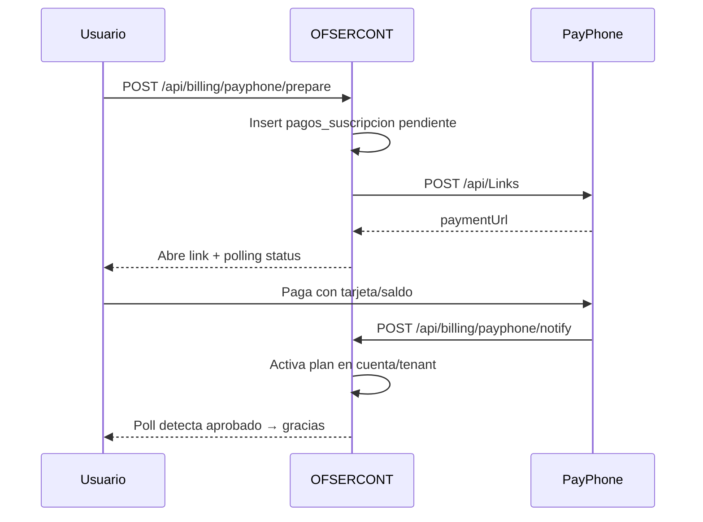

# PayPhone — cobro de suscripciones

Integración alineada con **exacontable**: [Payment Links](https://docs.payphone.app) (`POST /api/Links`) + webhook notify + polling.

El cliente Botón de Pago (`/api/button/Prepare` + Confirm) queda como legado/fallback en código, pero el checkout activo usa Links.

## Variables de entorno

| Variable | Descripción |
|----------|-------------|
| `PAYPHONE_TOKEN` | Bearer token de la app WEB en PayPhone Developer |
| `PAYPHONE_STORE_ID` | StoreId del comercio |
| `PAYPHONE_APP_URL` | Origen público HTTPS (resultado / emails). Ej. `https://ati.exacontable.com` |
| `PAYPHONE_API_BASE` | Default `https://pay.payphonetodoesposible.com` |
| `PAYPHONE_IVA_PERCENT` | `0` = cobro sin IVA. Si `15`, el precio se trata como total con IVA incluido |

En PayPhone Developer (app tipo **WEB**):

1. Dominio web = host de producción
2. URL de notificación (webhook) = `{APP_URL}/api/billing/payphone/notify`

## Flujo activo (Payment Links)



HTTP hacia PayPhone usa **HTTP/1.1** (mismo workaround TLS de exacontable).

## Endpoints

| Método | Ruta | Uso |
|--------|------|-----|
| GET/POST | `/api/billing/payphone/prepare` | Lista planes / crea link |
| GET | `/api/billing/payphone/status?pagoId=` | Polling UI |
| POST | `/api/billing/payphone/notify` | Webhook PayPhone |
| GET | `/api/billing/payphone/callback` | Legado Botón de Pago |
| POST | `/api/billing/payphone/confirm` | Legado Confirm manual |

## Migración

```bash
# PostgreSQL
psql $DATABASE_URL -f prisma/migrations/008_payphone_suscripciones.sql
```

También requiere `007_planes_suscripcion.sql` (precios de planes).

## UI

- `/registro` — wizard; paso 3 abre Payment Link y espera aprobación
- `/suscripcion` — renovación / upgrade autenticado
- `/registro/gracias` — resultado post-pago
- Admin puede asignar plan manualmente en Usuarios / Empresas

## Recurrencia operativa

- No hay cargo automático con tokenización.
- Cron `GET /api/cron/suscripciones` (Bearer `CRON_SECRET`): marca `plan_estado=vencido` y crea notificaciones T-7/T-3/T-1.
- Renovar = nuevo Prepare (Links); vigencia se acumula sobre `plan_vigente_hasta` si aún no venció.

## Referrer-Policy

PayPhone valida el dominio de origen. Evita `Referrer-Policy: no-referrer`. Preferible `origin` o `origin-when-cross-origin`.
