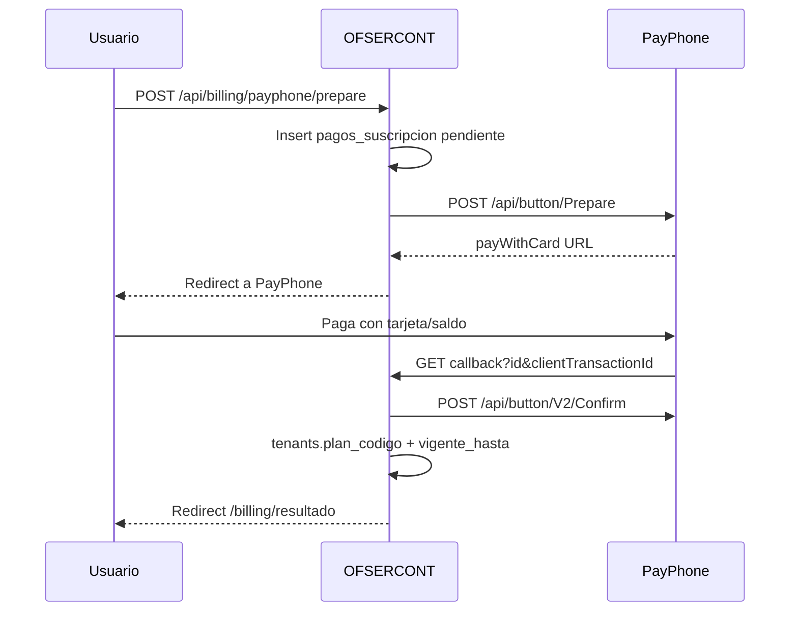

# PayPhone — cobro de suscripciones

Integración con [Botón de Pago](https://docs.payphone.app/boton-de-pago) (Prepare → redirect → Confirm).

## Variables de entorno

| Variable | Descripción |
|----------|-------------|
| `PAYPHONE_TOKEN` | Bearer token de la app WEB en PayPhone Developer |
| `PAYPHONE_STORE_ID` | StoreId del comercio |
| `PAYPHONE_APP_URL` | Origen público HTTPS (debe coincidir con el dominio registrado). Ej. `https://app.ofsercont.com` |
| `PAYPHONE_API_BASE` | Default `https://pay.payphonetodoesposible.com` |
| `PAYPHONE_IVA_PERCENT` | `0` = cobro sin IVA (`amountWithoutTax`). Si `15`, el precio se trata como total con IVA incluido |

En PayPhone Developer (app tipo **WEB**):

1. Dominio web = mismo host que `PAYPHONE_APP_URL`
2. URL de respuesta = `{PAYPHONE_APP_URL}/api/billing/payphone/callback`

## Flujo



Confirmación **obligatoria en &lt; 5 minutos** o PayPhone revierte el cobro.

## Migración

```bash
# PostgreSQL
psql $DATABASE_URL -f prisma/migrations/008_payphone_suscripciones.sql
```

También requiere `007_planes_suscripcion.sql` (precios de planes).

## UI

- `/` — homepage comercial EXA ATI
- `/precios` — catálogo público mensual/anual
- `/suscripcion` — checkout autenticado (PayPhone Prepare)
- `/facturacion/resultado` — resultado post-pago
- Admin sigue pudiendo asignar plan manualmente en Empresas

## Recurrencia operativa

- No hay cargo automático con tokenización.
- Cron `GET /api/cron/suscripciones` (Bearer `CRON_SECRET`): marca `plan_estado=vencido` y crea notificaciones T-7/T-3/T-1.
- Renovar = nuevo Prepare; vigencia se acumula sobre `plan_vigente_hasta` si aún no venció.

## Referrer-Policy

PayPhone valida el dominio de origen. Evita `Referrer-Policy: no-referrer` en el redirect. Preferible `origin` o `origin-when-cross-origin`.
