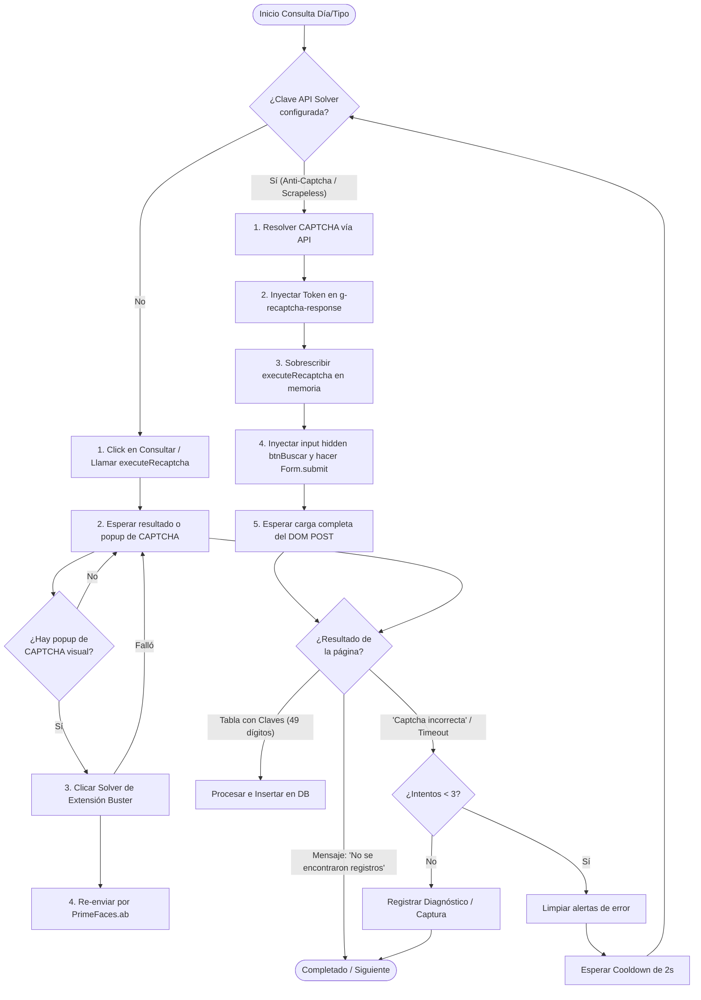

# Resolución de reCAPTCHA Enterprise en SriPlaywrightScraper

Este documento describe la arquitectura y el flujo real de resolución del desafío **reCAPTCHA Enterprise v2** implementado en [sri-playwright-scraper.ts](file:///C:/Users/ismaa/OneDrive/Documentos/GitHub/Exa-ati/src/lib/scraping/sri-playwright-scraper.ts). Este mecanismo es crítico para evitar el error habitual de **"CAPTCHA incorrecto"** al consultar comprobantes electrónicos recibidos en el portal del SRI en línea.

---

## 1. El Desafío del Portal SRI (JSF & PrimeFaces)
El portal del SRI utiliza **reCAPTCHA Enterprise** y gestiona el estado de la página mediante el framework **JavaServer Faces (JSF)** con **PrimeFaces**. Esto introduce dos problemas principales al intentar automatizar consultas de forma tradicional:
1. **Caducidad y desincronización de tokens**: Si se resuelve el captcha mediante clicks y luego se envía una petición AJAX de PrimeFaces, es común recibir un error de validación o un CAPTCHA incorrecto debido a discrepancias en el estado del lado del servidor (`javax.faces.ViewState`).
2. **Bloqueo del flujo AJAX**: Si se intenta hacer click en el botón "Consultar" múltiples veces con captchas obsoletos, la sesión se corrompe rápidamente.

Para solucionar esto de raíz, el scraper implementa una **estrategia de doble resolución** respaldada por un **POST directo al formulario**.

---

## 2. Flujo General de Búsqueda y Resolución

El siguiente diagrama detalla cómo se ejecuta la consulta de comprobantes y cómo se recupera ante fallos de CAPTCHA:



---

## 3. Estrategia A: Solver Externo de API (Recomendado)
Cuando se define `ANTICAPTCHA_KEY` o `SCRAPELESS_API_KEY`, el scraper no interactúa directamente con la casilla visual del reCAPTCHA. En su lugar, realiza una resolución silenciosa y una inyección en memoria.

### Paso 1: Obtención del Token
Se realiza una llamada asíncrona a la API del resolvedor (`Anti-Captcha` o `Scrapeless`) proporcionando la URL del portal del SRI, la `siteKey` corporativa del SRI (`6LdukTQsAAAAAIcciM4GZq4ibeyplUhmWvlScuQE`) y la acción del portal (`consulta_cel_recibidos`).

### Paso 2: Inyección de Token y Mocking de API reCAPTCHA
Una vez recibido el token de resolución, se ejecuta un script en el contexto del navegador para:
* Rellenar el elemento de texto invisible `#g-recaptcha-response`.
* Sobrescribir `window.grecaptcha.enterprise.execute` para que devuelva directamente una Promesa con el token inyectado.
* Reemplazar la función global del SRI `executeRecaptcha` para que devuelva el token inmediatamente al ser invocada.

```javascript
// Inyección en memoria
const ta = document.getElementById('g-recaptcha-response');
if (ta) ta.value = token;

window.executeRecaptcha = (action, source) => {
  const ta2 = document.getElementById('g-recaptcha-response');
  if (ta2) ta2.value = token;
  return token;
};
```

### Paso 3: Bypass del AJAX de PrimeFaces (Form Submit)
Para evitar que PrimeFaces contamine la petición con su estado AJAX, el scraper **no hace click en el botón "Consultar"**. En su lugar, realiza un envío de formulario POST tradicional inyectando los parámetros esperados por el servlet JSF:

```javascript
const form = document.getElementById('frmPrincipal');
let hidden = form.querySelector('input[name="frmPrincipal:btnBuscar"]');
if (!hidden) {
  hidden = document.createElement('input');
  hidden.type = 'hidden';
  hidden.name = 'frmPrincipal:btnBuscar';
  hidden.value = 'Consultar';
  form.appendChild(hidden);
}
form.submit(); // Carga de página POST limpia
```

---

## 4. Estrategia B: Fallback con Extensión Buster (Audio Solver)
Si no hay APIs configuradas y el scraper se ejecuta en modo visible (`HEADLESS=false`), se recurre a la resolución visual y auditiva integrada en el navegador utilizando la extensión **Buster** localizada en `scripts/buster`.

1. El scraper hace click en el botón físico **Consultar** (lo que activa la validación del reCAPTCHA).
2. Si el reCAPTCHA despliega un desafío visual de imágenes, el scraper escanea los `iframes` de la página buscando el sub-frame del desafío (`api2/bframe` o identificadores que empiezan por `c-`).
3. Localiza el botón de la extensión Buster (`#solver-button`) y le hace click para transcribir el desafío de audio mediante APIs de reconocimiento de voz.
4. Tras resolverlo, el token se inyecta y se ejecuta manualmente la función AJAX de PrimeFaces:
   ```javascript
   window.PrimeFaces?.ab?.({ source: 'frmPrincipal:btnBuscar' });
   ```

---

## 5. Detección de "Captcha Incorrecto" y Loop de Reintento
En ocasiones, la API del resolvedor devuelve un token inválido o caducado, resultando en un error devuelto por la pasarela del SRI. El scraper maneja esto de forma proactiva:

### Detección
Tras realizar la consulta, se evalúa el cuerpo de la respuesta. Si se detectan selectores `.ui-messages-error, .rf-msg-err` o textos como:
* `"captcha incorrecta"`
* `"captcha incorrecto"`
* `"incorrecto"` o `"incorrecta"` en elementos de alerta.

El scraper marca el resultado de búsqueda como `captcha_error`.

### Recuperación
Si se clasifica como `captcha_error`, el script realiza las siguientes operaciones:
1. **Limpieza del UI**: Ejecuta un script para cerrar las ventanas de diálogo de error de PrimeFaces haciendo click en los botones de cerrar (`.ui-messages-close, .rf-msg-close`).
2. **Espera de enfriamiento (Cooldown)**: Espera `2000ms` para que la cola de eventos de red del navegador y el ViewState de la sesión se estabilicen.
3. **Reintento**: Incrementa el contador de intentos de búsqueda y repite el proceso desde la resolución del CAPTCHA. Se permiten hasta **3 intentos** por cada día de consulta antes de desistir y tomar una captura de diagnóstico.

---

> [!TIP]
> **Recomendación para Producción**
> Se aconseja utilizar el método **Estrategia A (Anti-Captcha / Scrapeless)** en servidores de producción. Es mucho más rápido, no depende de la interfaz gráfica y tiene una tasa de éxito superior al 95% al saltarse por completo las validaciones AJAX del portal mediante el envío directo del formulario.
